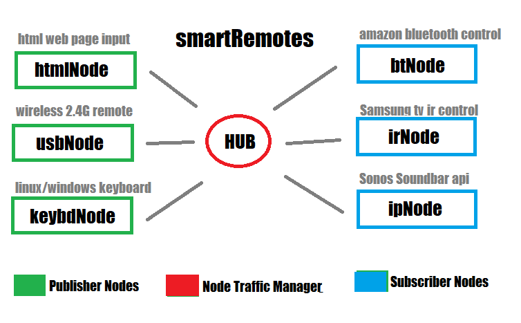

[Home](https://github.com/HeadHodge/smartHome-Projects-Main/blob/main/README.md)

# **My Smart Remotes Project:**

### **Overview:**

smartRemotes is a simple framework to control all the devices around my home with a variety of input control devices. It's to control many devices i.e. tv, stereo, shades, fireplace, lights, etc. with a single input control device, like a wireless usb remote control. Conversely it's to control a single device, like a fireplace, with a variety of input control devices, i.e. remote control, keyboard, wall mounted control panel, web page, etc.

My objective is to capture input from a variety of sources and use the input to control a variety of my home devices (mainly, but not totally, entertainment equipment).
  
 

**Main Features:**

Currently captures input from:
  - web pages
  - wired and wireless mice, keyboards, and remote controls
  - any HID compliant input device
  - wireless and other ip based data input.

I use web sockets to transport this input around the home to the devices the input is intended to control.

I use 'bridges' to convert captured input from a variety of input devices to ip packets which are routed to other 'bridges' that convert the packets to formats required to control the intended device. 

The main 'bridges' I've written and use are:

  - web sockets servers and clients to transfer data around my lan to their intended destinations with durable long lasting connections.
  - usb HID input data capture from any HID compliant device, i.e. wired/wireless keyboards, mice, and remote controls
  - Ird data capture from IR remotes and keypads
  - Ird blasters to transmit Ird to control IR controlled devices
  - ip based interaces to control various ip based devices, i.e. Sonos, Huntington shades, Wimo outlets, Hassio Hub
  - low power (ble) bluetooth peripheral servers to emulate HID keyboards, mice, and consumer control devices via 'HoG' (HID over Gatt) to control bluetooth based devices, i.e. FireTV stick

More info: [Using smartRemotes](https://github.com/HeadHodge/My-SmartHome-Projects/tree/main/documents/Using-smartRemotesMain/tree/main/smartRemotes)
