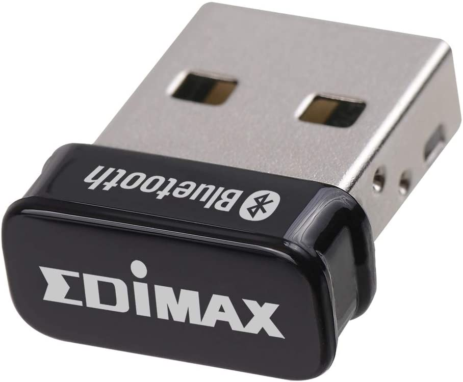
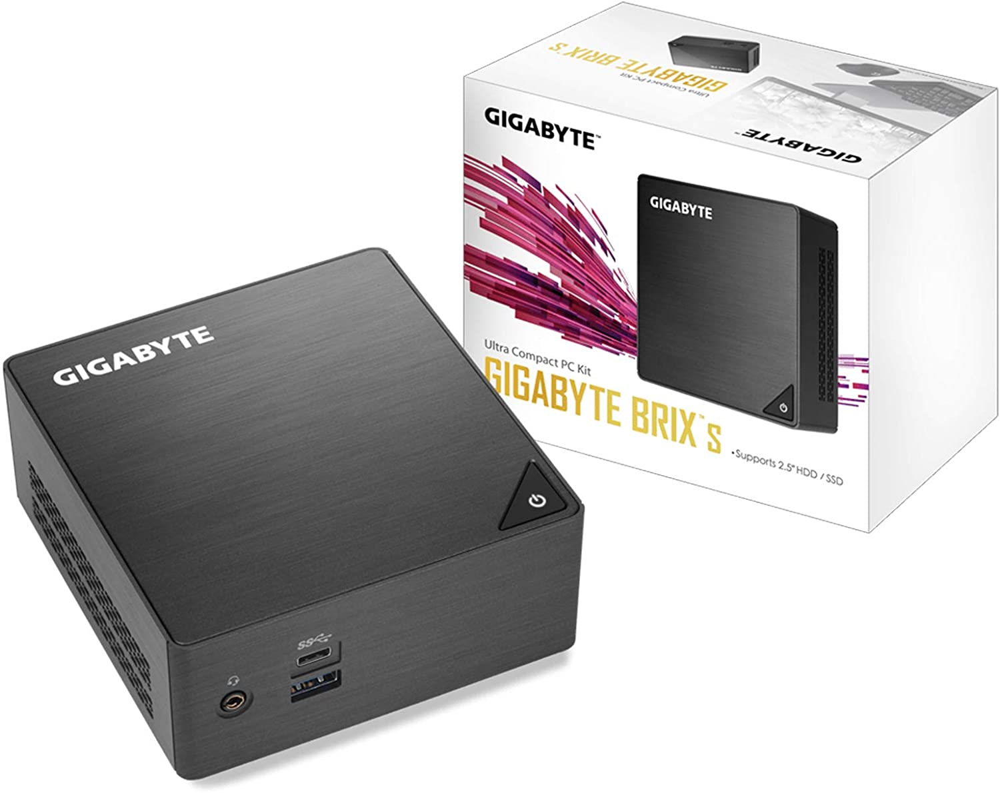

** heads-up, document under construction. subject to many updates **

# Using My Virtual Bluetooth Keyboard
## Overview:

I've found 3 ways of using the Zephyr rtos for my virtual bluetooth keyboard peripheral that all work well...

1. Use the Zephyr support for a native_posix_x86 board to create a linux executable that runs on any linux x86 box and uses the linux kernel distributed hci bluetooth controller to use the onboard bluetooth soc.

2. Same as option 1 except provide your own usb hci controller and soc for any linux x86 box that doesnt have a supported onboard soc.  https://www.amazon.com/dp/B08M1VJHVD?psc=1&ref=ppx_yo2_dt_b_product_details

3. Program the compiled image onto any Zephyr supported soc board, like the nRF52840 dongle. SupportedBoards:https://docs.zephyrproject.org/latest/boards/index.html#boards  
 https://www.mouser.com/ProductDetail/Nordic-Semiconductor/nRF52840-Dongle?qs=gTYE2QTfZfTbdrOaMHWEZg%3D%3D&mgh=1&gclid=CjwKCAjw_L6LBhBbEiwA4c46uj8hwq3PdIPZfNVH8l0bPHUx-mP9aKUwK6NtwtzDSJV9iLa59FsNzRoCfj0QAvD_BwE 

I have a working nRF52840 dongle, but I'm personally using option 1 in my home using an Ubuntu server 20.04 on a BRIX mini  https://www.amazon.com/dp/B07DMM7Z7N?psc=1&ref=ppx_yo2_dt_b_product_detail 

The BRIX comes with an Intel bluetooth/wifi soc that works really well with Ubuntu, as opposed to the junk broadcom/realtec socs that come with many cheapo chinese mini boxes.

In this writeup, I'll focus on how to use the virtual keyboard I created, then afterwards I'll describe how I created it to help understand how it works and help others roll their own.
