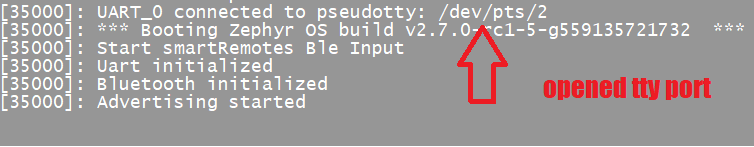

** heads-up, document under construction. subject to many updates **

# Using My Virtual Bluetooth Keyboard
## Overview:

I've found 3 ways of using the Zephyr RTOS for my virtual bluetooth keyboard peripheral that all work well...

1. Use the Zephyr support for a native_posix_x86 board to create a linux executable that runs on any linux x86 box and uses the linux kernel distributed hci bluetooth controller to use the onboard bluetooth soc.

2. Same as option 1 except provide your own usb hci controller and soc for any linux x86 box that doesnt have a supported onboard soc.  https://www.amazon.com/dp/B08M1VJHVD?psc=1&ref=ppx_yo2_dt_b_product_details

3. Program the compiled image onto any Zephyr supported soc board, like the nRF52840 dongle. SupportedBoards:https://docs.zephyrproject.org/latest/boards/index.html#boards  
 https://www.mouser.com/ProductDetail/Nordic-Semiconductor/nRF52840-Dongle?qs=gTYE2QTfZfTbdrOaMHWEZg%3D%3D&mgh=1&gclid=CjwKCAjw_L6LBhBbEiwA4c46uj8hwq3PdIPZfNVH8l0bPHUx-mP9aKUwK6NtwtzDSJV9iLa59FsNzRoCfj0QAvD_BwE 

I have a working nRF52840 dongle, but I'm personally using option 1 in my home using an Ubuntu server 20.04 on a BRIX mini  https://www.amazon.com/dp/B07DMM7Z7N?psc=1&ref=ppx_yo2_dt_b_product_detail 

The BRIX comes with an Intel bluetooth/wifi soc that works really well with Ubuntu, as opposed to the junk broadcom/realtec socs that come with many cheapo chinese mini boxes.

In this writeup, I'll focus on how to use the virtual keyboard I created, then afterwards I'll describe how I created it to help understand how it works and help others roll their own.

### Using Option 1: Zephyr with linux on-board bluetooth soc

* I found out the hard way it's essential to have properly working hardware. Most of the cheap mini x86 boxes I tried didn't work, because the hardware is either crap or there is simply no properly working linux drivers available.

* Install Ubuntu 20.04 lts server on your x86 box and make sure everything is up to date. Use the root user:

  #~ sudo passwd root
  
  #~ su
  
* Install Bluez, then disable it. Bluez is not needed, but it's useful to use the tools that come with it, like hcitools, btmon, and bluetoothctl, but we don't want bluez interfering.

  #~ systemctl stop bluetooth
  
  #~ systemctl disable bluetooth
  
  #~ systemctl mask bluetooth

* Install prerequisites for Zephyr https://docs.zephyrproject.org/latest/getting_started/index.html

  #~ wget https://apt.kitware.com/kitware-archive.sh
  
  #~ bash kitware-archive.sh
  
  #~ apt install --no-install-recommends git cmake ninja-build gperf ccache dfu-util device-tree-compiler wget python3-dev python3-pip python3-setuptools python3-tk python3-wheel xz-utils file make gcc gcc-multilib g++-multilib libsdl2-dev
  
  Check for proper versions:
  
  #~ cmake --version (3.20.0)
 
  #~ python3 --version (3.6)
  
  #~ dtc --version (1.4.6)
  
* Check for a valid hci controller is available

  #~ hciconfig (hci0 should be available and 'down')

* Download a copy of my smartRemotes directory to your box

  https://github.com/HeadHodge/My-SmartHome-Projects/releases/tag/v1.0
  
  start the Zephyr peripheral in its own shell:
  
  #~ /smartRemotes/imports/bt-ble/hogInput.exe --bt-dev=hci0
  
  If it's running properly, you should see output like: 'Bluetooth Enabled, Advertising Started'. If Zephyr starts ok, it opens a tty port for you to send hid reports to the paired client. Take note of the port name to be used later.
  
   
  
  If you see that output, then you should be able to pair this keyboard peripheral (advertised as 'smartRemote 1.0') to other peer clients, i.e. Win 10, FireTV other keyboards, etc. Sample output when peer client pairs properly.
  
   
  
One thing I really love about Zephyr is that it implements persistent state storage. So once a peer is paired, they will always try to reconnect again whenever or however they may become disconnected. Bluez does not have this feature which makes it unusable or at least unstable.

