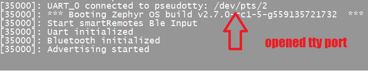
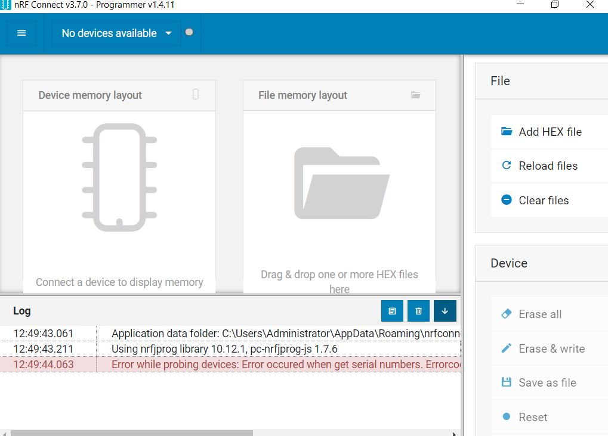

[Overview](https://github.com/HeadHodge/My-SmartHome-Projects/blob/main/documents/Overview-bluetoothKeyboard/README.md)

## Using My Virtual Bluetooth Keyboard

I've found 3 ways of using the Zephyr RTOS for my virtual bluetooth keyboard peripheral that all work well...

1. Use the Zephyr support for a native_posix_x86 board to create a linux executable that runs on any linux x86 box and uses the linux kernel distributed hci bluetooth controller to use the onboard bluetooth soc.

2. Same as option 1 except provide your own usb hci controller and soc for any linux x86 box that doesnt have a supported onboard soc.

3. Program the compiled image onto any Zephyr supported soc board, like the nRF52840 dongle. 

In this writeup, I'll focus on how to use the virtual keyboard I created, then afterwards I'll describe how I created it to help understand how it works and help others roll their own.

### Using Option 1: Zephyr with linux on-board bluetooth soc

* I found out the hard way it's essential to have properly working hardware. Most of the cheap mini x86 boxes I tried didn't work, because the hardware is either crap or there is simply no properly working linux drivers available.

* Install Ubuntu 20.04 lts server on your x86 box and make sure everything is up to date. Use the root user:

  #~ sudo passwd root
  
  #~ su
  
* Install Bluez, then disable it. Bluez is not needed, but it's useful to use the tools that come with it, like hcitools, btmon, and bluetoothctl, but we don't want bluez interfering.

  #~ systemctl stop bluetooth
  
  #~ systemctl disable bluetooth
  
  #~ systemctl mask bluetooth

* Install prerequisites for Zephyr https://docs.zephyrproject.org/latest/getting_started/index.html

  #~ wget https://apt.kitware.com/kitware-archive.sh
  
  #~ bash kitware-archive.sh
  
  #~ apt install --no-install-recommends git cmake ninja-build gperf ccache dfu-util device-tree-compiler wget python3-dev python3-pip python3-setuptools python3-tk python3-wheel xz-utils file make gcc gcc-multilib g++-multilib libsdl2-dev
  
  Check for proper versions:
  
  #~ cmake --version (3.20.0)
 
  #~ python3 --version (3.6)
  
  #~ dtc --version (1.4.6)
  
* Check for a valid hci controller is available

  #~ hciconfig (hci0 should be available and 'down')

* Download a copy of my smartRemotes directory to your box

  https://github.com/HeadHodge/My-SmartHome-Projects/releases/tag/v1.0
  
* Start the Zephyr peripheral in its own terminal:
  
  #~ /smartRemotes/imports/bt-ble/hogInput.exe --bt-dev=hci0
  
  If it's running properly, you should see output like: 'Bluetooth Enabled, Advertising Started'. If Zephyr starts ok, it opens a tty port for you to send hid reports to the paired client. Take note of the port name to be used later.
  
   
  
  If you see that output, then you should be able to pair this keyboard peripheral (advertised as 'smartRemotes 5.1') to other peer clients, i.e. Win 10, FireTV other keyboards, etc. Sample output when peer client pairs properly(you can also snoop all the exciting connect/pair activity by using 'btmon'):
  
   
  
One thing I really love about Zephyr is that it implements persistent state storage. So once a peer is paired, they will always try to reconnect again whenever or however they may become disconnected. Bluez does not have this feature which makes it unusable or at least unstable.


### Using Option 2: Zephyr with an external usb bluetooth soc

Using this option is practically identical to using option 1. Here is only the difference:

* Plug in the usb bluetooth device and verify an HCI controller is available.

  #~ hciconfig
  
  If a controller is available hciconfig should list it as hci0 with state of 'down' (not powered). If you also have an onboard controller, you will see hciconfig list hci0 and hci1. In my experience the usb controller was always hci0.
  
 When you run:
 
 #~ /smartRemotes/imports/bt-ble/hogInput.exe --bt-dev=hci0 
 
 make sure you specify the correct controller.
 
 I think that's it!
 

### Using Option 3: Zephyr with external usb soc board

With this option, the Zephyr peripheral resides and runs solely on a soc micro board which contains its own on-board bluetooth/wifi radio. It will run on any box that supports tty serial i/o.

You can set up a Zephyr build chain on linux to program your micro soc board, but I found it easier to install Nordic's nrfConnect v.3.7.0 for Win10 and use it's programmer to burn your image to the soc board. https://www.nordicsemi.com/Products/Development-tools/nrf-connect-for-desktop
  
   
  
  Here you can setup your own Zephyr build chain to create your own custom image or use my image to test with. To setup a build chain, follow Zephyr's instructions in their documentaion: https://docs.zephyrproject.org/latest/getting_started/index.html
  
To use my image, use the Nordic programmer to burn this file: \bluetoothKeyboard\hogKeyboard-dongle\hogKeyboard.hex to your soc board.

Once the image is programed, the image will reboot each time you unplug/plug the soc dongle. If my image starts properly, the dongle will open a vCom serial port on the box the dongle is plugged into, and both onboard led's will start flashing. The flashing blue led means the dongle is in GAP mode and advertising for peer clients to discover. The flashing yellow means the dongle is not connected to a peer client.

You should now be able to use any peer client i.e. Windows 10, Amazon Firestick other keyboards to connect and pair to your HID peripheral.

Once connected, use the serial port i.e. /dev/ttyacm0 to send HID reports to the connected peer.

### Sending HID Reports (keyboard characters) to peer clients

Congratulations if you made it this far and was able to pair with a peer client. It literally took me months to get this far, the first time around.

Being connected to a peer client as an HID peripheral is fun, but not much use if you can't send keyboard codes to the peer.

One of the things that happens when the Zephyr peripheral starts is to open a serial port for you to send your HID keycode reports. The port uses standard serial port communication protocols and you need to be able to stuff 6 bytes of data down the serial port for each HID report you want sent to the peer.

My smartRemotes project is a collection of loosely coupled modules designed to do this. Using these modules are not required and may even be overkill for some situations. So at this point you need to decide how you want to interface to the serial port.

```
Three HID Reports are supported, each 6 bytes long.

keyboard report: byte 1: 0xff (sync byte)
		 byte 2: 0x01 (report id)
		 byte 3: modifier byte
		   bits: 0-L CTRL, 1-L SHIFT, 2-L ALT, 3-L GUI, 4-R CTRL, 5-R SHIFT, 6-R ALT, 7-R GUI
		 byte 4: hid keyboard keyCode
		 byte 5: 0x00 (reserved)
		 byte 6: 0x00 (reserved)
		 		 
consumer report: byte 1: 0xff (sync byte)
		 byte 2: 0x02 (report id)
		 byte 3: low byte of hid consumer keyCode
		 byte 4: high byte of hid consumer keyCode
		 byte 5: 0x00 (reserved)
		 byte 6: 0x00 (reserved)
		 
mouse report   : byte 1: 0xff (sync byte)
		 byte 2: 0x03 (report id)
		 byte 3: modifier byte
		   bits: 0-left Click, 1-middle Click, 2-right Click
		 byte 4: x-axis offset
		 byte 5: y-axis offset
		 byte 6: 0x00 (reserved)

List of 6 byte HID Reports I use to control an Amazon Firestick

	{"Home"      : [0xff, 0x02, 0x23, 0x02, 0x00, 0x00]}
	{"Menu"      : [0xff, 0x02, 0x40, 0x00, 0x00, 0x00]}
	{"Back"      : [0xff, 0x02, 0x46, 0x00, 0x00, 0x00]}
	{"Up"        : [0xff, 0x02, 0x42, 0x00, 0x00, 0x00]}
	{"Down"      : [0xff, 0x02, 0x43, 0x00, 0x00, 0x00]}
	{"Left"      : [0xff, 0x02, 0x44, 0x00, 0x00, 0x00]}
	{"Right"     : [0xff, 0x02, 0x45, 0x00, 0x00, 0x00]}
	{"Ok"        : [0xff, 0x02, 0x41, 0x00, 0x00, 0x00]}
	{"Forward"   : [0xff, 0x02, 0xB3, 0x00, 0x00, 0x00]}
	{"Backward"  : [0xff, 0x02, 0xB4, 0x00, 0x00, 0x00]}
	{"PlayToggle": [0xff, 0x02, 0xCD, 0x00, 0x00, 0x00]}

```
Here is a python code snippet than will work to drive a tty port:

```
print('Load ttyBridge')

import sys, time, json, threading, traceback, asyncio
import serial, noteTool

_parent = sys.modules["__main__"]
        
##########################
async def deliverReport(connection, report):
##########################
    try:
        #print(f'***deliverCommand: {report}')
        connection.write(report)
        #await receiveReports(connection)
    except:
        print('Abort deliverCommand', sys.exc_info()[0])
        traceback.print_exc()
        
##########################
def receiveReports(connection):
##########################
    try:
        print(f' \n***receiveReports')
        
        while True:
            report = connection.readline()
            if(len(report) == 0): break
            print(f'{report[0:-2]}')        
    except:
        print('Abort receiveReports', sys.exc_info()[0])
        traceback.print_exc()

###################
#     start
###################
def start(options={}):
    print(f'Start ttyBridge: {options["connection"]["port"]}')

    try:    
        options['connection'] = serial.Serial(
            options['connection']['port'],
            options['connection']['speed'], 
            timeout=options['connection']['timeout'],
            parity=options['connection']['parity'], 
            xonxoff=options['connection']['xonxoff'], 
            rtscts=options['connection']['rtscts']
        )

        if(options['connection'].is_open == False): print('Abort: open serial port failed'); return;
        
        onConnect = options.get('onConnection', None)
        if(onConnect != None): asyncio.run(onConnect())
        receiveReports(options['connection'])
    except:
        print('Abort ttyBridge', sys.exc_info()[0])
        traceback.print_exc()
	
```

### Starting Option 1 & 2 at system reboot

If your happy with your HID peripheral and don't want to always manually open the service in a foreground terminal window, just auto start the peripheral as a systemd service:

* Copy service file \smartRemotes\services\smartRemotes-posix.service to /etc/systemd/system

	#~ systemctl enable smartRemotes-posix.service

	#~ systemctl restart smartRemotes-posix.service
	
* To view the systemd log the service creates:

	#~ /smartRemotes/scripts/posixLog.sh
	

  
  


